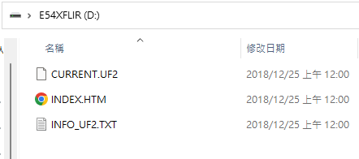
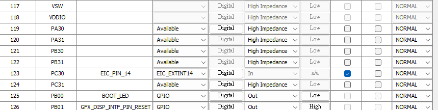
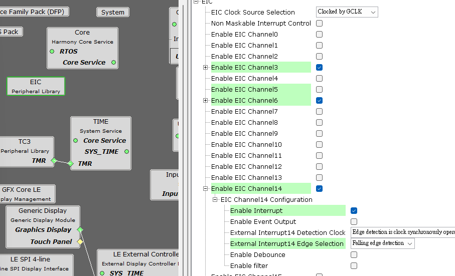
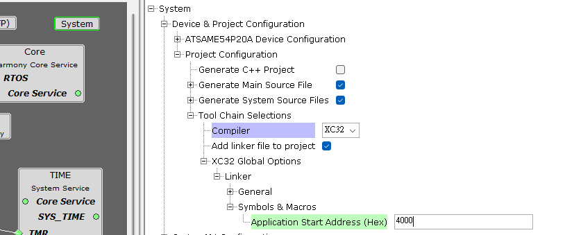
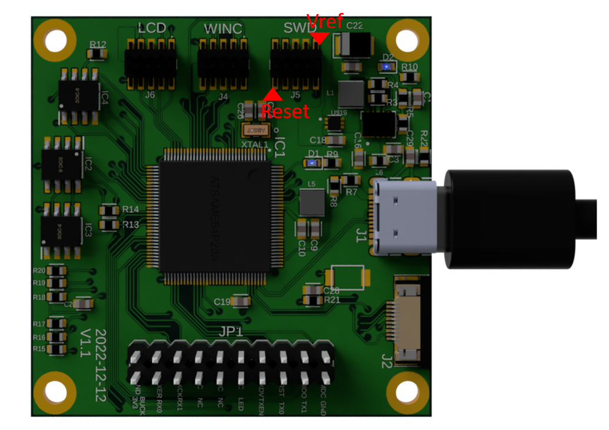

# E54Board
This is a quick guide for E54Board.

## Overview:


## Components

| item                  | Model      | note      |
| --------------------- | ---------- | --------- |
| EEPROM                | AT24C02    | Installed |
| Crypto IC             | ATECC608A  | Installed |
| QSPI FLash            | SST26      | Installed |
| SWD                   | -          | Installed |
| FPC (SPI+I2C)         | -          | Installed |
| WINC1500              | ATWINC1500 | optional  |
| LCD                   |            | optional  |
| micro SD              |            | optional  |
| touch sensor          |            | optional  |
| Xplained I/O Expander |            | optional  |


# Flash Bootloader

You can use J-Link or Atmel/Microchip programmer to program the bootloader.

# Flash User Application

## Upload User Application

1. Plug the USB Connector to your computer.

2. Press the Boot Button.

3. A new disk will be found immediately. Drag the user upgrade application to the disk.

    

## Enter boot entry in USER Application

Configure pins MPLAB Harmony 3 in IDE:




Add EIC14 Interrupt function 




Modify the start of address 




To make your application enter boot entry, you can add the following code to main:

````c
void EIC_Pin14Callback (uintptr_t context);
void EIC_Pin14Callback (uintptr_t context)
{
    asm("nop");
    *((volatile uint32_t *)(HSRAM_ADDR + HSRAM_SIZE - 4)) = 0xf01669ef;
    NVIC_SystemReset();
}

int main(){
```
 EIC_CallbackRegister(EIC_PIN_14, EIC_Pin14Callback, 0);
 EIC_InterruptEnable(EIC_PIN_14);
```
}
````

## Enter bootloader entry by Reset

In some applications, the user button is occupied and we  cannot trigger bootloader mode by pressing the button. However, the bootloader can  still be triggered by the Reset pin. One can  wire the Reset pin to ground and  the board will go bootloader mode immediately.


